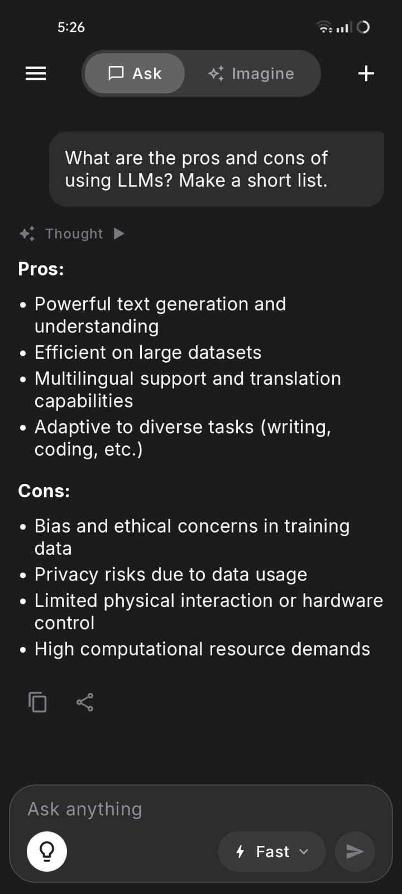
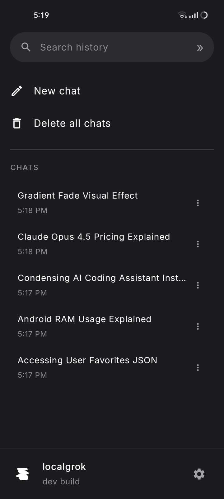
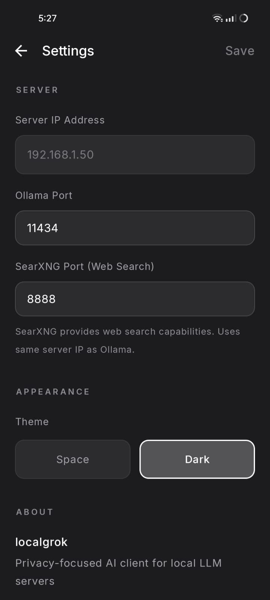
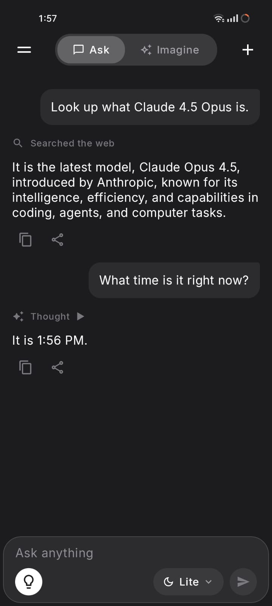

# localgrok

<div align="center">

**A privacy-focused Android client for local LLM servers running Ollama**

*Your conversations never leave your local network* 🔒

[](https://www.android.com)
[](https://kotlinlang.org)
[](https://developer.android.com/jetpack/compose)
[](LICENSE)

</div>

---

## Features

### 🔐 Privacy & Security
- **100% Local Network**: All communication stays on your local network - no data ever leaves your devices or network
- **Offline-First**: Full functionality works without internet connection once configured
- **Local Storage**: All conversations saved locally using Room database with automatic persistence

### 💬 Chat Experience
- **Real-Time Streaming**: See AI responses appear token-by-token in real-time for instant feedback
- **Multiple Chat Sessions**: Create, manage, and switch between unlimited conversation threads
- **Markdown Rendering**: Beautifully formatted responses with full Markdown support including code blocks, lists, and formatting
- **Chat History**: Persistent chat history with automatic title generation from the first message

### 🧠 AI Capabilities
- **Model Selection**: Choose from any model available on your Ollama server (llama, qwen, mistral, etc.)
- **Reasoning Mode**: Enable "thinking" mode for models that support it - see the AI's reasoning process (toggle with 💡 icon)
- **Tool Calling**: Optional web search integration via SearXNG for real-time information when needed
- **Smart System Prompts**: Intelligent system prompts that automatically adapt based on enabled features

### 🎨 User Interface
- **Multiple Themes**: Choose between Space (near-black) and Dark (grey) themes
- **Modern Design**: Clean, terminal-inspired aesthetic with Material 3 components
- **Custom Typography**: JetBrains Mono and Space Grotesk fonts for a distinctive, professional look
- **Edge-to-Edge**: Immersive full-screen experience that adapts to your device
- **Responsive Layout**: Optimized for all Android screen sizes from phones to tablets

## Usage

### Basic Chat

1. **Start a New Chat**: Tap the menu icon (☰) to open the sidebar, then tap "New Chat"
2. **Send Messages**: Type your message in the input field and tap send (or press Enter)
3. **View Responses**: Responses stream in real-time as the AI generates them

### Advanced Features

#### Brain Toggle (💡)
Toggle the lightbulb icon to enable/disable:
- **Enabled**: AI can use reasoning mode (shows thinking process) and web search tools
- **Disabled**: Standard chat mode without tools or reasoning

#### Model Selection
- Tap the model name in the input bar to see available models
- Select a different model for each chat session
- Your model preference is saved automatically

#### Multiple Chats
- Swipe right or tap the menu icon (☰) to access your chat list
- Tap any chat to resume the conversation
- Long-press a chat to delete it
- Use "Delete All" in settings to clear all chats

#### Themes
- Access settings via the gear icon
- Choose between **Space** (near-black, default) and **Dark** (grey) themes
- Theme preference is saved automatically

See [SETUP.md](SETUP.md) for more detailed usage instructions.

## Screenshots

<div align="center">

   

</div>

## Requirements

- **Android**: 8.0 (API 26) or higher
- **Ollama Server**: Running on your local network (see setup below)
- **Network**: Both devices (Android phone and server) must be on the same Wi-Fi network
- **SearXNG** (Optional): For web search capabilities when brain toggle is enabled

## Quick Start

### 1. Setup Fonts

The app requires custom fonts. Run the provided script:

```bash
cd scripts
chmod +x download_fonts.sh
./download_fonts.sh
```

See [SETUP.md](SETUP.md) for manual font installation instructions.

### 2. Setup Ollama Server

On your server machine (PC, Mac, or Linux):

```bash
# Install Ollama
curl -fsSL https://ollama.com/install.sh | sh

# Pull a model
ollama pull llama3.2

# Start Ollama with network access (required!)
OLLAMA_HOST=0.0.0.0 ollama serve
```

> **⚠️ Important**: By default, Ollama only listens on localhost. You must set `OLLAMA_HOST=0.0.0.0` to allow connections from other devices.

### 3. Configure the App

1. Open **localgrok** on your Android device
2. Tap the **Settings** icon (⚙️) in the top right
3. Enter your server IP address (find it with `ip addr` or `ifconfig` on Linux/Mac)
4. Port should be `11434` (default Ollama port)
5. Tap **"Test Connection"** to verify
6. Tap **"Save Settings"**

See [SETUP.md](SETUP.md) for detailed setup instructions including SearXNG configuration.

## Building

### Prerequisites

- **Android Studio**: Hedgehog (2023.1.1) or later
- **JDK**: 17 or higher
- **Android SDK**: API 35 (Android 15)
- **Gradle**: 8.13.1 (included via wrapper)

### Build Steps

```bash
# Clone the repository
git clone https://github.com/yourusername/localgrok.git
cd localgrok

# Download required fonts
cd scripts && ./download_fonts.sh && cd ..

# Build debug APK
./gradlew assembleDebug

# Install on connected device
./gradlew installDebug
```

The APK will be located at `app/build/outputs/apk/debug/app-debug.apk`.

### Opening in Android Studio

1. Open Android Studio
2. Select **File → Open**
3. Navigate to the `localgrok` directory
4. Wait for Gradle sync to complete
5. Run the app with **Shift+F10** or the Run button

## Documentation

- **[SETUP.md](SETUP.md)** - Detailed setup, configuration, and usage guide
- **[ARCHITECTURE.md](ARCHITECTURE.md)** - Project architecture, tech stack, and design patterns
- **[TROUBLESHOOTING.md](TROUBLESHOOTING.md)** - Common issues and solutions
- **[CONTRIBUTING.md](CONTRIBUTING.md)** - Guidelines for contributors

## License

MIT License - see [LICENSE](LICENSE) file for details.

---

<div align="center">

**localgrok** - Privacy-first AI on your local network 🔒

Made with ❤️ for the privacy-conscious

</div>